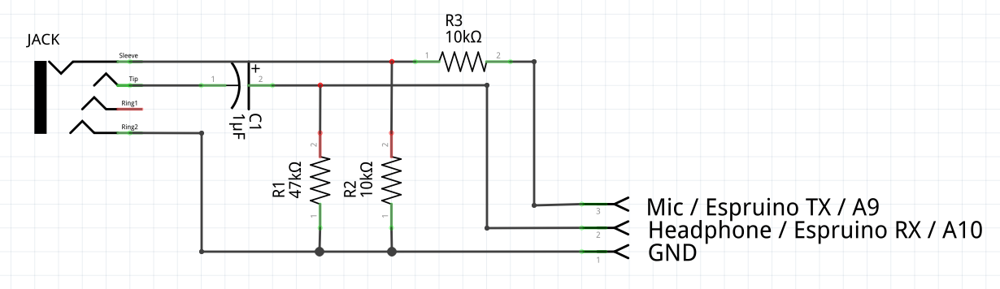
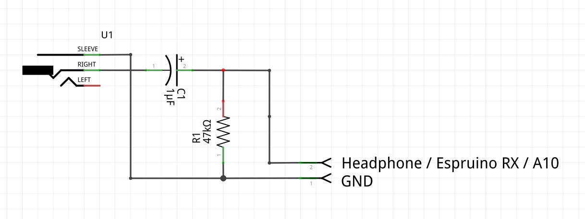

EspruinoOrion - Eclipse Orion plugin
====================================

Espruino plugin for Eclipse Orion.

[There's a forum post about it here](http://forum.espruino.com/conversations/257732/)

Simply:

* Host this on an HTTPS capable webserver (or use [GitHub](https://espruino.github.io/EspruinoOrion/))
* Add [plugin.html](https://espruino.github.io/EspruinoOrion/plugin.html) to Eclipse Orion
* Open [index.html](https://espruino.github.io/EspruinoOrion/index.html) in a new window
* Connect Espruino to your AUDIO JACKS (wiring below)
* In Orion, open a file, go to 'Tools', and click 'Send to Espruino'

If you'd rather just use USB and the Web IDE...

* Use Chrome and install the [Web IDE](http://github.com/espruino/EspruinoWebIDE)
* Add [plugin.html](https://espruino.github.io/EspruinoOrion/plugin.html) to Eclipse Orion
* Open [ide.html](https://espruino.github.io/EspruinoOrion/ide.html) in a new window

Or if you want to use Blockly instead:

* Open [index.html](https://espruino.github.io/EspruinoOrion/index.html) in a new window
* Open [blockly.html](https://espruino.github.io/EspruinoOrion/blockly.html) 

**Note:** If this doesn't work, your device may have RX and/or TX polarity mixed up. Try clicking the checkboxes and trying again.

One-way communication
------------------

You can also do one-directional communication (from the PC to an Espruino board). There's a simple library for this called [serial_to_audio.js](serial_to_audio.js).

Examples of this are:

* [blockly_simple.html](https://espruino.github.io/EspruinoOrion/blockly_simple.html) - the previous Blockly Example, but with no need for a separate window. Works perfectly on tablets!
* [colour_chooser.html](https://espruino.github.io/EspruinoOrion/colour_chooser.html) - a simple colour chooser that will change the colour of connected WS2811 lights (on B15) when you click a coloured square.

How it works
----------

Data is sent and received at 9600 baud using your headphone and microphone jacks - no local software needed!

When you click 'Send to Espruino' in Orion, a cookie is set with the code in.

The Terminal (index.html) reads this code and converts it to sound waves which it sends to Espruino.

Connections
----------

* Connect Espruino GND to the sheath on both headphone and microphone jacks
* Connect Espruino A9 (TX) to a 10k resistor, and connect that to the microphone Left+Right
* Connect a 10k resistor to the microphone sheath and connect that to microphone Left+Right too
* Connect Espruino A10 (RX) to the Left channel of the headphone jack
* Connect a 40k resistor between the headphone jack left channel and the headphone jack sheath

This creates: 
* A potential divider to convert the 3.3v Espruino TX signal to a 1.6v signal for the microphone
* A bias to 1.6v for Espruino's RX (by default Espruino turns on an internal 40k pullup resistor on the Usart to stop noise getting in)

**Note:** Most computers have a ~10uF capacitor in their headphone output - this allows the DC bias to work. However some computers may not have it, in which case the resting voltage for A10 will be 0v insread of 1.6v. In that case, you'll need to add a 10uF capacitor between Espruino + the resistor and the actual headphone output.

Connections for One-way communication
----------------------------------------

This is just as before, but with the microphone part removed - so you only have two parts to solder!
